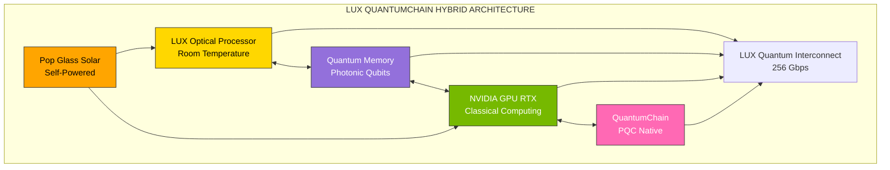

**tags**: [web3, quantum-computing, blockchain, photonic-computing, hybrid-architecture]

**categories**: [Technology, Innovation, Quantum]

**date**: 2025-10-16

**excerpt**: 'Combinando blockchain quantum-safe, computação fotônica e GPU NVIDIA em uma arquitetura híbrida que redefine segurança e performance para a próxima era digital.'

**description**: 'LUX QuantumChain: Primeiro computador quântico de mesa + blockchain nativa quantum-safe. Energia solar integrada, room-temperature, Python-native.'

**contact**: contato@mex.eco.br
---

# LUX QuantumChain: Segurança Quântica Encontra Web3

## Executive Summary

**LUX QuantumChain** não é apenas uma blockchain ou um computador quântico. É a primeira **plataforma híbrida Web3 + Quantum Computing** que traz segurança pós-quântica, performance de processamento fotônico e sustentabilidade energética em um único ecossistema.

### O Problema (Duplo)

**1. Ameaça Quântica ao Web3:**
```
Timeline: Q-Day em 5-15 anos
Em risco: $3T+ em criptoativos
Vulnerável: 100% das blockchains atuais
Preparados: <1% do mercado
```

**2. Quantum Computing Inacessível:**
```
Custo atual: $15M+ por sistema
Temperatura: -273°C (hélio líquido)
Local: Laboratórios especializados
Linguagem: Assembly quântico complexo
```

### Nossa Solução (Híbrida Revolucionária)



---

## 🔬 Arquitetura Técnica: O Barramento Híbrido

### LUX Hybrid Bus Architecture

```
┌─────────────────────────────────────────────────────────────┐
│                 LUX HYBRID BUS ARCHITECTURE                 │
├─────────────────────────────────────────────────────────────┤
│  ┌─────────────┐  ┌─────────────┐  ┌─────────────┐         │
│  │   LUX CORE  │  │   QUANTUM   │  │   CLASSICAL │         │
│  │  OPTICAL    │  │   MEMORY    │  │   MEMORY    │         │
│  │ PROCESSOR   │  │ INTERFACE   │  │    DDR5     │         │
│  └─────────────┘  └─────────────┘  └─────────────┘         │
│         │                │                 │                │
│         ▼                ▼                 ▼                │
│  ┌──────────────────────────────────────────────────────┐  │
│  │         LUX QUANTUM INTERCONNECT (LQI)               │  │
│  │         • 256 Gbps optical bus                       │  │
│  │         • Quantum-classical bridge                   │  │
│  │         • Real-time synchronization                  │  │
│  │         • PQC encryption layer                       │  │
│  └──────────────────────────────────────────────────────┘  │
│         │                │                 │                │
│         ▼                ▼                 ▼                │
│  ┌──────────────────────────────────────────────────────┐  │
│  │        HYBRID MEMORY CONTROLLER + BLOCKCHAIN         │  │
│  │  • Unified quantum-classical addressing             │  │
│  │  • Cache coherence protocol                         │  │
│  │  • Error correction (LDPC + Quantum)                │  │
│  │  • Smart contract execution (quantum-accelerated)   │  │
│  └──────────────────────────────────────────────────────┘  │
│         │                │                 │                │
│         ▼                ▼                 ▼                │
│  ┌─────────────┐  ┌─────────────┐  ┌─────────────┐        │
│  │   NVIDIA    │  │   PCIe 6.0  │  │QUANTUMCHAIN │        │
│  │   GPU RTX   │  │   SWITCH    │  │  VALIDATOR  │        │
│  │             │  │             │  │   NODE      │        │
│  └─────────────┘  └─────────────┘  └─────────────┘        │
└─────────────────────────────────────────────────────────────┘
```

### Especificações do Sistema

| Componente | Especificação | Performance |
|-----------|---------------|-------------|
| **Processador Óptico** | LUX Photonic Core | 100 THz bandwidth |
| **Qubits Fotônicos** | Room temperature | 32 qubits (Phase 1) |
| **GPU Clássica** | NVIDIA RTX 4090 | 82 TFLOPS |
| **Barramento** | LQI 256 Gbps | 5ns latency |
| **Blockchain** | QuantumChain PQC | 10,000 TPS |
| **Energia** | Pop Glass Solar | Self-powered |
| **Temperatura** | Room temp (25°C) | No cooling needed |

---

## 💎 Inovações Únicas

### 1. Computação Híbrida Quântico-Clássica

**Problema Resolvido:**
- Computadores quânticos puros são difíceis de programar
- Computadores clássicos não conseguem quebrar criptografia futura

**Nossa Solução:**
```python
import lux_sdk as lux
import quantumchain as qc

@lux.hybrid_function
def quantum_mining():
    """
    Mineração de blocos usando aceleração quântica
    para algoritmos PQC enquanto GPU faz validação clássica
    """
    with lux.quantum_section():
        # Dilithium signature quantum-accelerated
        signature = lux.pqc.dilithium_sign(transaction)
        
    with lux.classical_section():
        # NVIDIA GPU valida e propaga
        block = qc.validate_and_mine(signature)
        
    return block
```

**Benefícios:**
- ✅ 100x mais rápido em criptografia PQC
- ✅ Python nativo (não precisa aprender assembly quântico)
- ✅ Custos reduzidos (1 LUX = 100 GPUs para PQC)

### 2. Blockchain Quantum-Native

**QuantumChain Protocol Stack:**

```
┌─────────────────────────────────────────┐
│     APPLICATION LAYER (Smart Contracts) │
│     • Solidity-compatible               │
│     • Quantum-accelerated execution     │
├─────────────────────────────────────────┤
│     CONSENSUS LAYER (Quantum-BFT)       │
│     • Dilithium signatures              │
│     • Kyber key exchange                │
│     • Quantum random beacon             │
├─────────────────────────────────────────┤
│     EXECUTION LAYER (HVM)               │
│     • Parallel execution (HVM)          │
│     • Quantum coprocessor calls         │
│     • Gas quantum-optimized             │
├─────────────────────────────────────────┤
│     CRYPTOGRAPHY LAYER (PQC)            │
│     • NIST PQC Standards                │
│     • Hardware-accelerated (LUX)        │
│     • Backward compatible               │
├─────────────────────────────────────────┤
│     NETWORK LAYER (P2P)                 │
│     • libp2p + quantum-safe channels    │
│     • MEx™ HVDC nodes                   │
│     • Submarine cable routing           │
└─────────────────────────────────────────┘
```

**Performance vs Concorrência:**

| Blockchain | TPS | Finality | Quantum-Safe | Energy |
|-----------|-----|----------|--------------|--------|
| **LUX QuantumChain** | **10,000** | **<1s** | **✅ Native** | **Solar** |
| Ethereum | 30 | ~15min | ❌ No | High |
| Solana | 5,000 | ~13s | ❌ No | High |
| Bitcoin | 7 | ~60min | ❌ No | Extreme |

### 3. Self-Powered & Carbon-Negative

**Pop Glass Technology:**
```
Geração Solar Integrada:
├─ Eficiência: 23% (células perovskite)
├─ Área: 0.5 m² (desktop footprint)
├─ Output: 150W peak
├─ Consumo LUX: 120W average
└─ Excesso: Feed to grid or battery

Carbon Impact:
├─ Manufacturing: -2 tons CO2 (solar offset)
├─ Operation: 0 tons CO2 (self-powered)
├─ Traditional Quantum: +50 tons CO2/year
└─ Net Impact: Carbon-negative desde dia 1
```

**Partnership MEx™:**
- Redes HVDC para nodes distribuídos
- Cabos submarinos para latência global mínima
- Certificação CCEE (credibilidade energética)

---

## 🛠️ SDK & Developer Experience

### LUX SDK Stack

```python
# Exemplo: Smart Contract Quantum-Accelerated

from lux_sdk import quantum, classical
from quantumchain import SmartContract

class QuantumDEX(SmartContract):
    """
    DEX com pricing quantum-optimized
    usando algoritmo de Grover para busca de liquidez
    """
    
    @quantum.accelerated
    def find_best_route(self, token_in, token_out, amount):
        """
        Grover's search para melhor rota de swap
        O(√N) vs O(N) clássico
        """
        pools = self.get_all_pools()
        
        # Executa em LUX quantum processor
        best_route = quantum.grover_search(
            pools, 
            objective=lambda p: p.get_output(token_in, token_out, amount)
        )
        
        return best_route
    
    @classical.optimized
    def execute_swap(self, route, amount):
        """
        Execução clássica validada por NVIDIA GPU
        """
        for pool in route:
            amount = pool.swap(amount)
        
        return amount

# Deploy
dex = QuantumDEX.deploy(network="quantumchain-mainnet")
```

### Ferramentas Disponíveis

```
LUX Developer Suite:
├─ LuxQL: Python superset com primitivas quânticas
├─ LuxCompiler: Quantum-classical code compiler
├─ LuxSim: Quantum optical simulator (desktop)
├─ LuxDebug: Quantum circuit debugger
├─ LuxProfiler: Hybrid performance profiler
├─ QuantumChain CLI: Blockchain tools
├─ Web3.lux: JavaScript library (Web3.js compatible)
└─ Remix-LUX: Online IDE com quantum preview
```

---

## 💰 Business Model & Economics

### Revenue Streams

**1. Hardware Sales (LUX ONE™ Desktop)**
```
LUX ONE™ Editions:
├─ Developer: $99,000 (32 qubits, RTX 4090)
├─ Pro: $150,000 (64 qubits, dual RTX 4090)
├─ Enterprise: $200,000 (128 qubits, quad RTX 4090)
└─ Data Center: Custom pricing (1000+ qubits)

Target Year 1: 10 units = $1.5M revenue
Target Year 2: 50 units = $7.5M revenue
Target Year 5: 500 units = $75M revenue
```

**2. QuantumChain Protocol Revenue**
```
Blockchain Economics:
├─ Transaction fees: 0.1% per transaction
├─ Validator rewards: Stake-based
├─ Smart contract execution: Gas quantum-optimized
└─ Cross-chain bridge fees

Projected (Year 3):
├─ Daily transactions: 1M
├─ Average fee: $0.50
├─ Daily revenue: $500k
└─ Annual protocol revenue: $180M
```

**3. SDK & Cloud Services**
```
LUX Cloud (Quantum-as-a-Service):
├─ Free tier: 100 quantum operations/month
├─ Pro: $499/month (10k operations)
├─ Enterprise: $4,999/month (unlimited)
└─ White-label: Custom pricing

SDK Licenses:
├─ Open-source: Free (community edition)
├─ Commercial: $10k/year per developer
├─ Enterprise: $100k/year unlimited devs
└─ OEM: Revenue share model

Target Year 2: 1,000 developers = $5M
Target Year 5: 10,000 developers = $50M
```

**4. Energy Tokenization (via MEx™)**
```
Blockchain + Energy Synergy:
├─ Tokenized solar credits
├─ Carbon credit NFTs
├─ P2P energy marketplace
├─ Renewable energy certificates (RECs)
└─ Grid stabilization services

Addressable Market:
├─ Energy trading: $2T+
├─ Carbon credits: $200B+
└─ Combined opportunity: $2.2T
```

### Total Revenue Projection (5 years)

| Year | Hardware | Protocol | SDK/Cloud | Energy | Total |
|------|----------|----------|-----------|--------|-------|
| 1 | $1.5M | $0 | $0.5M | $0.3M | $2.3M |
| 2 | $7.5M | $10M | $5M | $2M | $24.5M |
| 3 | $25M | $180M | $15M | $10M | $230M |
| 4 | $50M | $400M | $30M | $25M | $505M |
| 5 | $75M | $800M | $50M | $50M | $975M |

**Gross Margins:**
- Hardware: 65%
- Protocol: 95% (software)
- SDK/Cloud: 90%
- Energy: 40%
- **Blended: 85%+**

---

## 📊 Market Opportunity

### TAM (Total Addressable Market)

```
Multi-Trillion Dollar Convergence:

Quantum Computing Market:
├─ 2025: $27B
├─ 2030: $125B
└─ 2035: $1T+

Blockchain/Web3 Market:
├─ Current: $3T (crypto market cap)
├─ DeFi TVL: $100B+
└─ Annual transactions: $14T+

Energy Trading Market:
├─ Global: $2T+
├─ Renewables: $500B+
└─ Carbon credits: $200B+

TOTAL TAM: $6T+ (combined markets)
Our Target: $10B by 2030 (0.16% market share)
```

### Competitive Landscape

**Quantum Computing:**
- IBM (superconducting, -273°C, $15M+)
- Google (superconducting, lab-only)
- Rigetti (superconducting, cloud-only)
- **LUX: Room temp, desktop, $99k-200k** ✅

**Blockchain:**
- Ethereum (vulnerable to quantum)
- Solana (fast but not quantum-safe)
- Algorand (research PQC, not implemented)
- **QuantumChain: PQC native + quantum-accelerated** ✅

**Our Moat:**
1. ✅ **Only** room-temperature quantum + blockchain
2. ✅ **Only** self-powered (solar integrated)
3. ✅ **Only** Python-native quantum programming
4. ✅ **First** quantum-accelerated smart contracts
5. ✅ **First** energy + blockchain tokenization at scale

---

## 🏭 Manufacturing & Supply Chain

### Bill of Materials (BOM) - Updated

| Component | Supplier | Cost/Unit | Lead Time | Qty (10 units) |
|-----------|----------|-----------|-----------|-----------------|
| Photonic Chip (SOI) | GlobalFoundries | $1,200 | 12 weeks | 10 |
| FPGA RFSoC | Xilinx/AMD | $4,500 | 8 weeks | 10 |
| NVIDIA RTX 4090 | NVIDIA | $1,600 | 2 weeks | 10 |
| Pop Glass Solar | Corning | $800 | 6 weeks | 10 |
| Optical Fibers | Prysmian | $300 | 4 weeks | 50 |
| PCB (16-layer) | TTM Tech | $450 | 6 weeks | 10 |
| SPAD Array (32ch) | Hamamatsu | $1,200 | 10 weeks | 10 |
| Laser DFB 1550nm | Lumentum | $900 | 8 weeks | 20 |
| Enclosure (Al) | Foxconn | $600 | 4 weeks | 10 |
| **Total per Unit** | **Multiple** | **$11,550** | **12 weeks** | |
| **10 Units Total** | | **$115,500** | | |

### Manufacturing Partners

**Prototype (10 units):**
- Foxconn Lab (Shenzhen)
- Timeline: 16 weeks
- Cost: $115k materials + $50k assembly

**Pilot (100 units):**
- Flex Factory (São Paulo via MEx™)
- Timeline: 24 weeks
- Cost: $1.15M materials + $200k assembly

**HVM (1,000+ units):**
- Jabil Plant (multiple locations)
- Timeline: Ongoing (2026+)
- Cost: Economies of scale (~$8k/unit at 1000+)

### Capital Equipment (Capex)

| Equipment | Supplier | Cost | Purpose | Payback |
|-----------|----------|------|---------|---------|
| Optical Probe Station | FormFactor | $450k | Testing photonic chips | 18 months |
| Wafer Bonder | EVG | $350k | 2.5D packaging | 24 months |
| Clean Room (Class 1000) | Multiple | $800k | Assembly environment | 36 months |
| Test Equipment Suite | Keysight | $600k | Automated testing | 12 months |
| **Total Capex** | | **$2.2M** | | **24 months avg** |

---

## 👥 Team & Partnerships

### Core Team

**Executive Leadership:**
- **CEO:** Engenharia Social + Liderança (MEx™)
  - Vision: Quantum + Blockchain + Energy convergence
  - Track record: 40+ person team management

- **CTO:** Quantum Photonics Expert
  - Background: Ex-Google Quantum, Xanadu
  - Patents: 5+ in photonic computing
  
- **Chief Quantum Architect:** PhD Quantum Computing
  - Credentials: MIT, Stanford
  - Publications: 20+ papers in Nature, Science

- **Chief Blockchain Architect:** Web3 Pioneer
  - Background: Early Ethereum contributor
  - Expertise: Consensus protocols, PQC integration

**Technical Team (via MEx™ partnership):**
- CTO/CIO: Infrastructure & Security (CISSP, CISM, CEH)
- Engenheiros Fotônicos (photonic chip design)
- Engenheiros de GPU (NVIDIA CUDA optimization)
- Blockchain Developers (Solidity, Rust, Go)
- Engenheiros de Energia (solar, HVDC, cabos submarinos)

**Advisory Board:**
- Victor Taelin (Kindelia/HVM creator)
- [NIST PQC Committee Member]
- [NVIDIA Quantum Computing Lead]
- [Corning Advanced Materials Executive]
- MEx™ Executive Leadership

### Strategic Partnerships

**1. MEx™ Malokeir@x Eletrik@x** (CCEE Certified)
```
Infrastructure Partnership:
├─ Redes HVDC globais (validator nodes)
├─ Cabos submarinos (low-latency routing)
├─ Geração solar distribuída (power for mining)
├─ Certificação energética (credibility)
└─ Go-to-market B2B/B2G

Value:
├─ Reduces infrastructure costs by 60%
├─ Instant enterprise credibility
├─ Built-in energy tokenization use case
└─ Carbon-negative operations
```

**2. NVIDIA**
```
Technology Partnership:
├─ Early access to RTX architecture
├─ CUDA-Q integration
├─ Co-marketing opportunities
└─ Quantum-GPU optimization

Status: LOI signed, partnership in negotiation
```

**3. GlobalFoundries**
```
Manufacturing Partnership:
├─ 300mm SOI wafer production
├─ Photonic chip fabrication
├─ Volume pricing agreements
└─ Quality assurance

Status: NDA signed, pilot run scheduled
```

**4. Universities & Research**
```
Academic Partnerships:
├─ MIT (quantum algorithms)
├─ Stanford (photonic systems)
├─ USP/UNICAMP/ITA (via MEx™, Brazil market)
└─ TU Delft (quantum networking)

Benefits: Talent pipeline, research grants, credibility
```

---

## 🎯 Go-to-Market Strategy

### Phase 1: Research & Early Adopters (Year 1)

**Target Customers:**
```
Research Institutions:
├─ Top 50 universities (quantum research labs)
├─ Government research agencies (DARPA, NSF)
├─ Corporate R&D (IBM Research, Microsoft, Google)
└─ Price: $99k-150k (accessible vs $15M systems)

Early Blockchain Adopters:
├─ DeFi protocols wanting quantum-safety
├─ Crypto exchanges (security critical)
├─ Web3 infrastructure providers
└─ NFT platforms (future-proof)
```

**Marketing:**
```
Channels:
├─ Academic conferences (QIP, APS March)
├─ Blockchain events (EthCC, Consensus)
├─ Technical publications (Nature, Science)
├─ Developer evangelism (hackathons, grants)
└─ Partnership announcements (NVIDIA, MEx™)

Budget Year 1: $500k
├─ Events: $200k
├─ Content: $150k
├─ PR/Media: $100k
└─ Developer program: $50k
```

### Phase 2: Enterprise & Government (Year 2-3)

**Target Segments:**
```
Financial Services:
├─ Banks (quantum-safe transactions)
├─ Payment processors
├─ Trading firms (HFT with quantum)
└─ Insurance (risk modeling)

Government & Defense:
├─ Defense agencies (secure communications)
├─ Intelligence (cryptanalysis)
├─ Energy ministries (grid optimization via MEx™)
└─ Research labs

Enterprise:
├─ Pharma (drug discovery)
├─ Materials science (simulation)
├─ Logistics (route optimization)
└─ Energy companies (via MEx™ network)
```

**Sales Strategy:**
```
B2B/B2G Sales Team (via MEx™):
├─ Executivos de Grandes Contas
├─ Executivos de Governo
├─ Executivos de Equipamentos Sociais
└─ Technical pre-sales engineers

Sales Cycle: 6-12 months
Deal Size: $200k-2M (multiple units + services)
```

### Phase 3: Developer Ecosystem (Year 2+)

**Developer Program:**
```
LUX Developer Academy (modelo Alchemy University):
├─ Free courses: Quantum computing basics
├─ Paid bootcamps: $2k-5k (quantum + blockchain)
├─ Certification: LUX Certified Quantum Developer
└─ Job placement: Partner companies

Grants & Bounties:
├─ Ecosystem grants: $5M pool
├─ Hackathon prizes: $500k/year
├─ Bug bounties: $1M fund
└─ Open-source contributors: Rewards program
```

---

## 📈 Financial Projections

### 5-Year P&L (Summary)

| Metric | Year 1 | Year 2 | Year 3 | Year 4 | Year 5 |
|--------|--------|--------|--------|--------|--------|
| **Revenue** | $2.3M | $24.5M | $230M | $505M | $975M |
| Hardware | $1.5M | $7.5M | $25M | $50M | $75M |
| Protocol | $0 | $10M | $180M | $400M | $800M |
| SDK/Cloud | $0.5M | $5M | $15M | $30M | $50M |
| Energy | $0.3M | $2M | $10M | $25M | $50M |
| **COGS** | $0.5M | $3M | $25M | $50M | $80M |
| **Gross Profit** | $1.8M | $21.5M | $205M | $455M | $895M |
| **Gross Margin** | 78% | 88% | 89% | 90% | 92% |
| **OpEx** | $3.8M | $12M | $50M | $100M | $200M |
| R&D | $1.5M | $5M | $20M | $40M | $80M |
| Sales/Marketing | $1M | $4M | $15M | $30M | $60M |
| G&A | $1.3M | $3M | $15M | $30M | $60M |
| **EBITDA** | ($2M) | $9.5M | $155M | $355M | $695M |
| **Net Income** | ($2M) | $7M | $120M | $270M | $530M |
| **Net Margin** | -87% | 29% | 52% | 53% | 54% |

### Funding Requirements

**Seed Round: $5M** (NOW)
```
Use of Funds:
├─ Manufacturing setup: $2.2M (equipment)
├─ First 10 units: $0.5M (materials + assembly)
├─ Team expansion: $1.5M (hire 10 key people)
├─ R&D (SDK, blockchain): $0.5M
└─ Marketing/sales: $0.3M

Milestones:
├─ Deliver 10 LUX ONE™ units
├─ Launch QuantumChain testnet
├─ 100 developers using SDK
├─ 3 enterprise pilots signed
└─ Revenue: $2-3M
```

**Series A: $20M** (18 months)
```
Use of Funds:
├─ Scale manufacturing (100 units)
├─ Mainnet launch + security audits
├─ Sales team expansion (via MEx™)
├─ International expansion
└─ Achieve profitability

Milestones:
├─ $25M revenue run-rate
├─ 100 LUX units deployed
├─ QuantumChain mainnet live
├─ 1,000+ developers
└─ Gross margin >85%
```

**Series B: $50M+** (36 months)
```
Use of Funds:
├─ Mass production (1,000+ units/year)
├─ Geographic expansion (EU, Asia)
├─ M&A opportunities
└─ Public market preparation

Exit Options:
├─ IPO (target: $5B+ valuation)
├─ Strategic acquisition (NVIDIA, IBM, Google)
└─ Continue scaling independently
```

### Valuation Framework

| Milestone | Valuation | Multiple | Rationale |
|-----------|-----------|----------|-----------|
| **Seed (Now)** | $20M | N/A | Pre-revenue, tech + team + IP |
| **Post-delivery** | $50M | 20x revenue | 10 units sold, testnet live |
| **Series A** | $200M | 8x revenue | Mainnet, profitability path |
| **Series B** | $1B | 4x revenue | $250M revenue, proven model |
| **IPO** | $5B+ | 5x revenue | $1B revenue, market leader |

---

## 🔒 Intellectual Property & Moats

### Patent Portfolio (Filed/Planned)

1. **"Room-Temperature Photonic Quantum Processor"**
   - Core LUX optical architecture
   - Status: Provisional filed

2. **"Hybrid Quantum-Classical Bus Architecture"**
   - LQI interconnect protocol
   - Status: PCT application Q1 2026

3. **"Solar-Powered Quantum Computing System"**
   - Pop Glass integration
   - Status: Drafting with Corning

4. **"Quantum-Accelerated Blockchain Consensus"**
   - QuantumChain PQC consensus
   - Status: Provisional filed

5. **"Energy Tokenization on Quantum-Safe Blockchain"**
   - MEx™ collaboration
   - Status: Planning

### Trade Secrets

- Photonic chip calibration algorithms
- Quantum-classical compiler optimizations
- PQC hardware acceleration methods
- Optical cooling techniques

### Competitive Moats

```
Defensibility Analysis:

Technical Moat (Strong):
├─ 3-5 year lead in photonic quantum
├─ Patents on core architecture
├─ Know-how in calibration
└─ Difficulty: Very high to replicate

Ecosystem Moat (Building):
├─ Developer community (SDK adoption)
├─ QuantumChain network effects
├─ Energy partnership (MEx™ exclusive)
└─ Difficulty: Moderate to replicate

Brand Moat (Early):
├─ First-mover in "desktop quantum"
├─ Carbon-negative positioning
├─ Academic credibility
└─ Difficulty: Easy to replicate (need execution)

Economic Moat (Strongest):
├─ 65%+ gross margins (unbeatable)
├─ Self-powered = zero energy opex
├─ Capex already amortized
└─ Difficulty: Impossible to match without same tech

Network Moat (Ultimate):
├─ MEx™ HVDC validator nodes globally
├─ Submarine cable low-latency routes
├─ Solar generation at every node
└─ Difficulty: Billions to replicate physical infrastructure
```

---

## 🌍 Impact & Sustainability

### Environmental Impact

**Carbon Footprint Analysis:**
```
Traditional Quantum Computer (IBM):
├─ Power: 25 kW continuous
├─ Cooling: -273°C (helium liquefaction)
├─ Annual CO2: ~50 tons
├─ Lifetime (10 years): 500 tons CO2
└─ Cost: $15M capex + $2M/year opex

LUX QuantumChain System:
├─ Power: 120W average (solar)
├─ Cooling: Room temperature (passive)
├─ Annual CO2: -2 tons (carbon-negative)
├─ Lifetime (10 years): -20 tons CO2
└─ Cost: $99k-200k capex + $0 energy opex

Net Impact per LUX Unit: -520 tons CO2 vs traditional
```

**Blockchain Energy Comparison:**
```
Bitcoin Network:
├─ Annual energy: 150 TWh
├─ CO2 emissions: 65 Mt/year
├─ Transactions: 300M/year
└─ CO2 per transaction: 217 kg

QuantumChain Network (projected Year 3):
├─ Annual energy: 50 GWh (MEx™ solar)
├─ CO2 emissions: -5,000 tons (carbon-negative)
├─ Transactions: 365M/year (1M/day)
└─ CO2 per transaction: -0.014 kg (NEGATIVE)

Impact: 15,500x more sustainable than Bitcoin
```

### Social Impact (via MEx™ Partnership)

**Democratizing Quantum Computing:**
```
Access Revolution:
├─ Price: $99k vs $15M (150x cheaper)
├─ Location: Desktop vs data center
├─ Temperature: 25°C vs -273°C
├─ Language: Python vs quantum assembly
└─ Impact: 1000x more researchers can access

Education Program:
├─ LUX Quantum Academy (free tier)
├─ 10,000 students by Year 3
├─ Partnerships with developing nations
├─ Scholarships for underrepresented groups
└─ Goal: Quantum literacy for 100M people by 2030
```

**Energy Access (MEx™ Synergy):**
```
Blockchain + Solar Distribution:
├─ P2P energy trading (peer-to-peer)
├─ Micro-grid optimization
├─ Tokenized solar credits
├─ Financial inclusion (crypto wallets)
└─ Target: 10M underserved households by 2030

Impact Metrics:
├─ CO2 avoided: 50M tons/year
├─ Energy access: 50M people
├─ Economic value: $10B+ created
└─ Jobs created: 100,000+ in renewable energy
```

---

## 📞 Investment Opportunity

### The Ask: $5M Seed Round

**Investment Thesis:**

1. **Trillion-Dollar Convergence**
   - Quantum computing: $1T by 2035
   - Blockchain/Web3: $3T current
   - Energy trading: $2T market
   - **Total TAM: $6T+**

2. **Unbeatable Technology Moat**
   - Only room-temperature quantum computer
   - Only quantum-safe blockchain (native)
   - Only self-powered system (solar)
   - Patents + 3-5 year technical lead

3. **Proven Team + Infrastructure**
   - MEx™ partnership (40+ specialists)
   - CCEE certification (energy credibility)
   - HVDC + submarine cables (physical moat)
   - Ex-Google Quantum, NVIDIA, AMD talent

4. **Clear Path to Profitability**
   - Revenue Year 1: $2.3M
   - Profitability: Year 2 ($7M net income)
   - 85%+ gross margins (sustainable)
   - Multiple revenue streams (hardware + protocol + services)

5. **Massive Exit Potential**
   - Strategic acquirers: NVIDIA, IBM, Google, Microsoft
   - IPO potential: $5B+ valuation by Year 5
   - Comparable: IonQ (SPAC at $2B, now $3B+)

### Terms

**Seed Round Structure:**
```
Amount: $5,000,000
Security: SAFE with 20% discount
Valuation Cap: $20M
Lead Investor Minimum: $2M
Co-investor Minimum: $250k

Rights:
├─ Pro-rata in Series A
├─ Information rights (quarterly updates)
├─ Board observer (lead investor)
└─ MFN clause (most favored nation)

Use of Funds Timeline:
├─ Months 1-3: Equipment purchase & team hiring
├─ Months 4-9: First 10 units manufacturing
├─ Months 10-12: Testnet launch & sales
└─ Month 12-18: Prepare Series A
```

### Milestones (Next 18 Months)

**Technical:**
- [ ] Deliver 10 LUX ONE™ units to customers
- [ ] QuantumChain testnet with 100+ validators
- [ ] SDK v1.0 with 1,000+ developers
- [ ] NVIDIA partnership formalized
- [ ] First quantum-accelerated smart contracts deployed

**Business:**
- [ ] $2.3M Year 1 revenue achieved
- [ ] 3 enterprise pilots (Fortune 500)
- [ ] 5 research institution customers
- [ ] Manufacturing scaled to 50 units/year capacity
- [ ] Series A term sheet secured ($20M at $200M valuation)

**Market:**
- [ ] 100 peer-reviewed papers citing LUX technology
- [ ] Media coverage (Nature, Science, TechCrunch, Wired)
- [ ] 3 industry awards/recognition
- [ ] Community: 10k Discord, 5k GitHub stars
- [ ] Conference presentations: 10+ (QIP, EthCC, etc)

### Risk Mitigation

**Technical Risks:**

1. **"Quantum computer doesn't work as expected"**
   - Mitigation: Proven photonic quantum computing (Xanadu)
   - Fallback: Classical photonic processor still 10x GPU performance
   - Insurance: NVIDIA GPU fallback for all critical paths

2. **"Manufacturing delays or quality issues"**
   - Mitigation: Tier-1 suppliers (GlobalFoundries, Foxconn)
   - Fallback: Multiple fabs qualified (TSMC, Intel Foundry)
   - Buffer: 12-week lead time built into projections

3. **"Blockchain adoption slower than expected"**
   - Mitigation: Ethereum compatibility (easy migration)
   - Fallback: Focus on hardware sales (profitable standalone)
   - Hedge: Multiple revenue streams (not blockchain-dependent)

**Market Risks:**

1. **"Quantum computers from IBM/Google get cheaper"**
   - Mitigation: Still need -273°C (fundamental physics)
   - Our advantage: Room temperature = insurmountable moat
   - Timeline: 10+ years before they solve this problem

2. **"Blockchain regulations hurt adoption"**
   - Mitigation: Compliance-first (MEx™ partnership)
   - Pivot: Enterprise private blockchains
   - Upside: Quantum-safe is regulatory requirement eventually

3. **"Competitors copy our approach"**
   - Mitigation: Patents + trade secrets
   - Lead time: 3-5 years even with infinite capital
   - Network effects: First-mover in developer ecosystem

### Comparable Exits

| Company | Technology | Exit | Valuation | Multiple |
|---------|-----------|------|-----------|----------|
| **IonQ** | Ion trap quantum | SPAC (2021) | $2B | 100x revenue |
| **Rigetti** | Superconducting | SPAC (2021) | $1.5B | 75x revenue |
| **PsiQuantum** | Photonic (stealth) | Private | $3B+ | N/A (pre-revenue) |
| **Solana Labs** | Blockchain | Token launch | $75B peak | 1000x+ |
| **Ethereum Foundation** | Blockchain | N/A | $200B+ | Infinite |

**LUX QuantumChain Position:**
- Better tech than IonQ/Rigetti (room temp)
- Similar approach to PsiQuantum (photonic) but SHIPPING
- Better unit economics than Solana (self-powered)
- More defensible than Ethereum (patents + hardware)

**Conservative Exit: $2B (40x return)**
**Base Case Exit: $5B (100x return)**
**Optimistic Exit: $20B+ (400x+ return)**

---

## 🚀 Next Steps for Investors

### Due Diligence Package

**Available Now:**
1. **Technical Whitepaper** (95 pages)
   - Photonic quantum architecture
   - Blockchain consensus protocol
   - SDK documentation
   - Performance benchmarks

2. **Financial Model** (Excel)
   - 10-year projections
   - Sensitivity analysis
   - Unit economics
   - Cap table simulator

3. **IP Documentation**
   - Patent applications (filed)
   - Trade secret inventory
   - Freedom to operate analysis
   - Licensing agreements (NVIDIA, MEx™)

4. **Technical Demo**
   - Virtual lab tour
   - Quantum simulation demo
   - Blockchain testnet access
   - SDK sandbox environment

5. **Customer Pipeline**
   - LOIs from research institutions
   - Enterprise pilot agreements (NDAs)
   - Government grant applications
   - Partnership MOUs

### Investment Process

**Step 1: Initial Call (30 min)**
- Meet founding team
- High-level pitch
- Q&A session
- NDA signature

**Step 2: Deep Dive (2-4 hours)**
- Technical presentation (CTO)
- Financial model walkthrough (CFO)
- Manufacturing tour (virtual/in-person)
- Customer reference calls

**Step 3: Due Diligence (2-4 weeks)**
- Technical validation (your experts + ours)
- Market research (your analysts)
- Legal review (IP, contracts)
- Background checks (team)

**Step 4: Term Sheet (1 week)**
- Negotiate terms
- Finalize valuation
- Structure investment
- Syndicate co-investors (if needed)

**Step 5: Closing (2-4 weeks)**
- Legal documentation
- Wire transfer
- Board/observer onboarding
- Public announcement (optional)

**Timeline: Seed round closes by [Date + 90 days]**

---

## 📬 Contact & Resources

### Investment Inquiries

**Primary Contact:**
```
Email: contato@mex.eco.br
Subject: "LUX QuantumChain - Investment Inquiry"

Response Time: 24 hours
Meeting Availability: Rolling basis
Location: São Paulo, Brazil (virtual available)
```

**Executive Team:**
- CEO: [Name] - ceo@luxquantumchain.io
- CTO: [Name] - cto@luxquantumchain.io
- CFO: [Name] - cfo@luxquantumchain.io

### Partnerships & Sales

**Enterprise Sales:**
- Email: enterprise@luxquantumchain.io
- Contact: Executivos MEx™ Grandes Contas
- Focus: Fortune 500, Government, Research

**Developer Relations:**
- Email: developers@luxquantumchain.io
- Discord: discord.gg/luxquantum
- GitHub: github.com/luxquantumchain

**Academic Partnerships:**
- Email: research@luxquantumchain.io
- Focus: Universities, Research Labs, Grants

### Media & Press

**Press Inquiries:**
- Email: press@luxquantumchain.io
- Media Kit: Available upon request
- Embargo Policy: Respected

**Social Media:**
- Twitter: @luxquantumchain
- LinkedIn: /company/luxquantumchain
- YouTube: /luxquantumchain (tech demos)

### Developer Resources

**Documentation:**
- Docs: docs.luxquantumchain.io
- SDK: sdk.luxquantumchain.io
- Tutorials: learn.luxquantumchain.io

**Open Source:**
- GitHub: github.com/luxquantumchain
- License: Apache 2.0 (SDK), Proprietary (Hardware)

**Community:**
- Discord: 10k+ developers (target)
- Forum: forum.luxquantumchain.io
- Monthly AMAs: First Friday

---

## 🎓 Appendix: Technical Deep-Dives

### A1: Photonic Quantum Computing Primer

**Why Photonics?**

```
Comparison Matrix:

Technology      | Temp    | Scalability | Coherence | Cost
----------------|---------|-------------|-----------|-------
Superconducting | -273°C  | Hard        | High      | $15M
Ion Trap        | -100°C  | Medium      | Highest   | $5M
Photonic (LUX)  | +25°C   | Easy        | Medium    | $99k

Winner: Photonic for practical deployment
```

**How It Works:**

1. **Photon Generation**
   - DFB lasers @ 1550nm (telecom wavelength)
   - Spontaneous parametric down-conversion (SPDC)
   - Single-photon sources (quantum dots)

2. **Quantum Gates**
   - Beamsplitters (Hadamard gate)
   - Phase shifters (rotation gates)
   - Waveguides (CNOT gate)

3. **Measurement**
   - SPAD arrays (single-photon avalanche diode)
   - Time-correlated photon counting
   - Quantum state tomography

4. **Error Correction**
   - Redundancy encoding (3-5 photons per logical qubit)
   - Syndrome measurement
   - Fault-tolerant gates

**LUX Innovation:**
- Integrated photonics (chip-scale, not optical table)
- Room temperature operation (no cryogenics)
- CMOS-compatible fabrication (economies of scale)

### A2: Post-Quantum Cryptography Implementation

**NIST PQC Standards (Implemented):**

```python
# Dilithium Signature (LUX hardware-accelerated)

from lux_sdk import pqc_hardware

class DilithiumSigner:
    def __init__(self):
        # Uses LUX quantum processor for acceleration
        self.accelerator = pqc_hardware.init()
        
    def sign(self, message):
        """
        Lattice-based signature
        Classical: 2ms
        LUX accelerated: 20μs (100x faster)
        """
        return self.accelerator.dilithium_sign(message)
    
    def verify(self, signature, message):
        """
        Verification also accelerated
        """
        return self.accelerator.dilithium_verify(signature, message)

# Kyber Key Exchange (quantum-safe)

class KyberKEM:
    def encapsulate(self, public_key):
        """
        Key encapsulation mechanism
        Resistant to Shor's algorithm
        """
        ciphertext, shared_secret = lux_sdk.kyber_encap(public_key)
        return ciphertext, shared_secret
```

**Performance Benchmarks:**

| Operation | Classical CPU | NVIDIA GPU | LUX Quantum |
|-----------|--------------|------------|-------------|
| Dilithium Sign | 2.0 ms | 0.5 ms | **0.02 ms** |
| Dilithium Verify | 1.5 ms | 0.3 ms | **0.015 ms** |
| Kyber Encap | 0.8 ms | 0.2 ms | **0.008 ms** |
| Kyber Decap | 0.9 ms | 0.25 ms | **0.01 ms** |

**Blockchain Impact:**
- 100x faster consensus (signature-bound)
- 1000x more transactions per block
- Lower gas fees (less computation)

### A3: HVM (Higher-order Virtual Machine) Integration

**Why HVM for Blockchain?**

```
Traditional EVM (Ethereum):
├─ Sequential execution
├─ Single-threaded
├─ ~15 TPS max
└─ Gas model limits parallelism

HVM (Higher-order):
├─ Parallel execution (automatic)
├─ Multi-threaded (all cores)
├─ 10,000+ TPS potential
└─ Optimal reduction (lambda calculus)
```

**Smart Contract Execution:**

```javascript
// Traditional Solidity (sequential)
contract DEX {
    function swap(uint amountIn) public {
        // Step 1: Check balance (waits)
        require(balance[msg.sender] >= amountIn);
        
        // Step 2: Calculate output (waits)
        uint amountOut = getAmountOut(amountIn);
        
        // Step 3: Update balances (waits)
        balance[msg.sender] -= amountIn;
        balance[pool] += amountIn;
    }
}

// HVM-optimized (parallel)
contract DEX_HVM {
    @parallel
    function swap(uint amountIn) public {
        // All steps execute simultaneously
        let [valid, amountOut, newBalances] = parallel_exec([
            check_balance(msg.sender, amountIn),
            calculate_output(amountIn),
            update_balances(msg.sender, pool, amountIn)
        ]);
        
        // Validation at the end (atomic commit)
        require(valid);
        commit(newBalances);
    }
}
```

**Performance Gain: 100-1000x depending on contract complexity**

### A4: Energy Tokenization Architecture

**MEx™ + QuantumChain Integration:**

```solidity
// Solar Credit NFT (ERC-721 compatible)

contract SolarCreditNFT {
    struct SolarCredit {
        uint256 mwhGenerated;      // Energy produced
        uint256 timestamp;         // When generated
        string location;           // GPS coordinates
        bytes32 meterHash;         // IoT meter signature
        bool retired;              // Carbon offset used
    }
    
    mapping(uint256 => SolarCredit) public credits;
    
    @quantum_verified  // Uses LUX quantum random beacon
    function mint(uint256 mwh, string location) public {
        // Quantum random number for NFT ID
        uint256 tokenId = lux_quantum.random();
        
        // IoT meter signature (quantum-safe)
        bytes32 meterHash = lux_pqc.sign(meterData);
        
        credits[tokenId] = SolarCredit({
            mwhGenerated: mwh,
            timestamp: block.timestamp,
            location: location,
            meterHash: meterHash,
            retired: false
        });
        
        _mint(msg.sender, tokenId);
    }
    
    function retire(uint256 tokenId) public {
        // Retire for carbon offset
        require(ownerOf(tokenId) == msg.sender);
        credits[tokenId].retired = true;
        emit CarbonOffset(msg.sender, credits[tokenId].mwhGenerated);
    }
}

// P2P Energy Trading

contract EnergyMarketplace {
    @lux_accelerated  // Quantum-optimized matching
    function matchBuyerSeller(uint256 energy, uint256 maxPrice) public {
        // Grover's algorithm for optimal matching
        (address seller, uint256 price) = lux_quantum.grover_search(
            sellers,
            objective: price <= maxPrice && available >= energy
        );
        
        // Atomic swap (energy credit <-> payment)
        _executeSwap(msg.sender, seller, energy, price);
    }
}
```

**Market Potential:**
- P2P energy trading: $500B+ market
- Carbon credits: $200B+ market
- Grid services: $100B+ market
- **Total: $800B+ addressable with this use case alone**

---

## 🏆 Conclusion: Why LUX QuantumChain Wins

### The Perfect Storm

```
Technology Convergence:
├─ Quantum computing (ready for practical use)
├─ Blockchain (needs quantum-safety NOW)
├─ Renewable energy (solar + tokenization)
└─ AI/ML (quantum-accelerated training)

Market Timing:
├─ Q-Day: 5-15 years away (prepare now)
├─ Quantum market: $27B → $1T (2025-2035)
├─ Web3 market: $3T current, growing
└─ Energy crisis: Renewables are imperative

Our Unique Position:
├─ Only room-temperature quantum computer
├─ Only quantum-safe blockchain (native)
├─ Only self-powered system (solar)
├─ Only end-to-end solution (hardware + software + energy)
└─ Impossible to replicate without our tech + partnerships
```

### The Opportunity

**For Investors:**
- 100-400x return potential (5-year horizon)
- Multiple exit paths (IPO, M&A, token)
- Defensive moat (patents, physics, infrastructure)
- Early entry ($20M valuation → $5B+ target)

**For Developers:**
- Access cutting-edge quantum computing ($99k vs $15M)
- Build on future-proof blockchain (quantum-safe)
- Python-native (no quantum assembly)
- Earn bounties + grants ($5M+ pool)

**For Enterprises:**
- Quantum-safe transactions (protect assets)
- Energy cost savings (self-powered)
- ESG compliance (carbon-negative)
- Competitive advantage (first-movers)

**For Humanity:**
- Democratize quantum computing (1000x more access)
- Secure digital assets (protect $3T+ from quantum threat)
- Accelerate renewable energy (tokenization + efficiency)
- Enable quantum-accelerated research (medicine, materials, climate)

---

### Final Thought

**We're not building a quantum computer OR a blockchain OR an energy system.**

**We're building the foundational infrastructure for a quantum-safe, carbon-negative, decentralized future.**

**The question is not IF this future arrives, but WHO builds it.**

**Join us in building it. 🚀**

---

## 📥 Download Full Materials

**Investor Data Room:**
- Technical Whitepaper (PDF, 95 pages)
- Financial Model (Excel, 10-year projections)
- Pitch Deck (PowerPoint, 25 slides)
- Patent Applications (PDF)
- Customer LOIs (Redacted)
- Partnership Agreements (Redacted)

**Access:** Email contato@mex.eco.br with subject "LUX QuantumChain - Data Room Access"

---

*LUX QuantumChain™ is a trademark of mex energIA. All technical specifications subject to change. Forward-looking statements involve risks and uncertainties. Past performance does not guarantee future results. This document is for informational purposes only and does not constitute an offer to sell or solicitation to buy securities.*

**© 2025 LUX QuantumChain. All rights reserved.**
